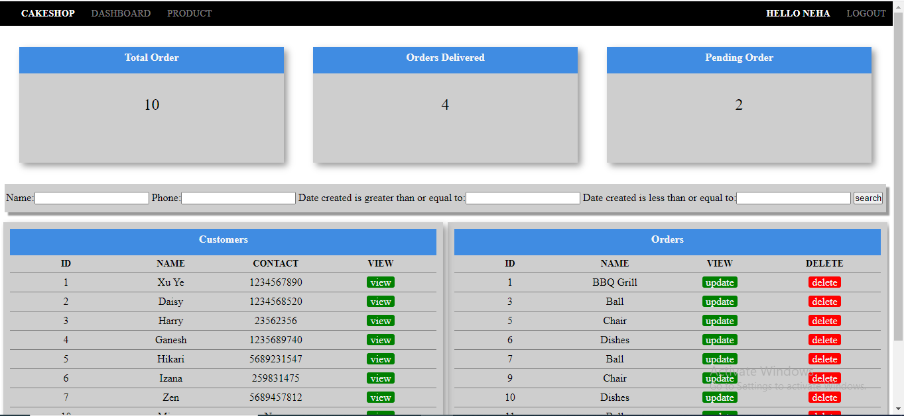

<h1 align='center'>OnlineShop</h1>
<h2>Introduction : </h2>

OnlineShop is a basic web application with django at backend and HTML5 and CSS3 used for designing front end. 
This is a basic shopping app, in which users can create their account, and view their profile, update it and look at their shopping dashboard.
Admin has the access to the customer data and the products, it can create and update products along with the orders by the customers.

<h2>Functioning : </h2>

At the beginning, the user can login to their accounts, and if they don't have accounts, they can create one, with the link provided. 
After successful registration they will be redirected to the login page with the succ message, where they can then login.

After login the user will be redirected to the user dashboard.

With the profile button user can visit their profile, which they can view and update.

When admin logs in, the admin willbe taken to the admin dashboard panel, Where admin have the options to create, read, update and delete the customers or the orders. 

admin can also perform search on basis of the customer name, their contact number, or based on the date, when their profile were created.

Admin can view the customer, create product orders, view, update or delete them.

Admin can make search of customer orders, based on product name, status or the date they were created.

